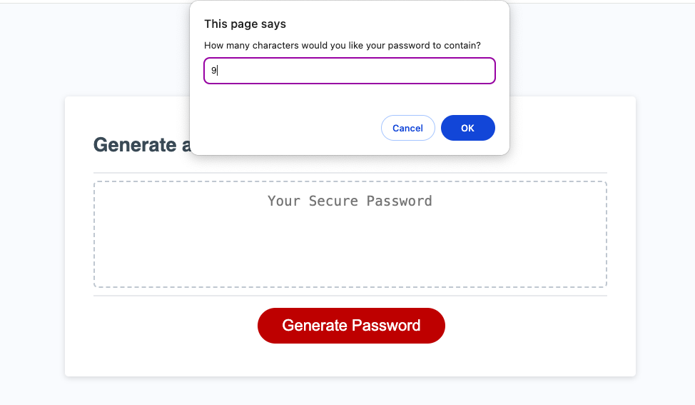
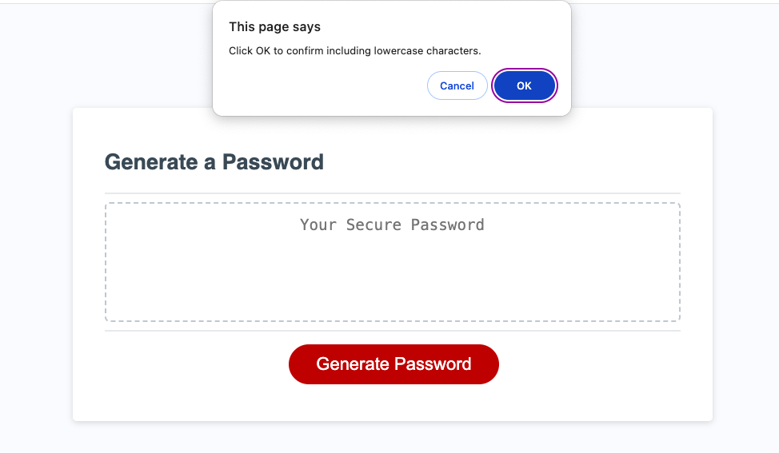
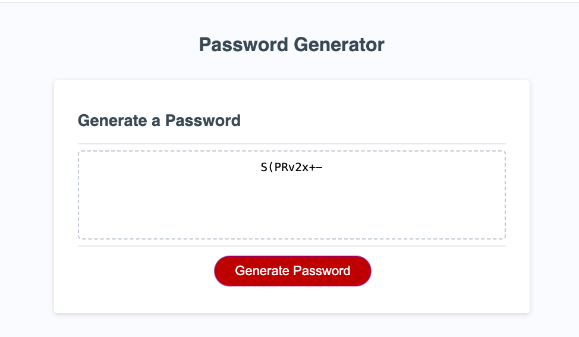

# Password Generator

## Description:
The password generator is designed for use by employees when creating new passwords for work-related purposes.

## Screenshots:
The following images show how the code works: 

## Features:
The password generator is unique in that it provides high security passwords with a length between 8 to 128 characters. It also provides a password with a lowercase letter, uppercase letter, number and a special character.

## Links
[Github reposatory](https://github.com/Zai-hub/password-generator)
###
[Deployment Link](file:///Users/zainabtouati/Desktop/bootcamp/password-generator/starter/index.html)

## References
https://owasp.org/www-community/password-special-characters
###
https://www.w3schools.com

## Licenses:
This is licensed by MIT. 